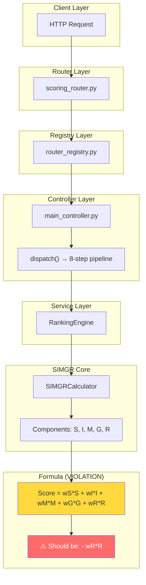

# SIMGR + Stage 3 Full Governance Audit
## Final Audit Summary

**Date:** 2026-02-16  
**Auditor:** Principal System Architect, MLOps Lead, Refactoring Authority  

---

## I. Folder Tree (Scoring Module)

```
backend/scoring/
├── __init__.py
├── baseline_capture.py
├── calculator.py          ← ❌ Formula violation (L101-107)
├── config.py              ← ❌ Hardcoded weights (L22-27)
├── engine.py
├── examples.py
├── models.py
├── normalizer.py
├── scoring.py             ← ❌ Formula violation (L227-233)
├── strategies.py
├── taxonomy_adapter.py
├── components/
│   ├── __init__.py
│   ├── growth.py          ← ❌ No crawler/forecast
│   ├── interest.py        ← ⚠️ Missing NLP/survey
│   ├── market.py          ← ⚠️ Missing salary data
│   ├── risk.py            ← ⚠️ Missing dropout/unemployment
│   └── study.py           ← ⚠️ Missing A, B factors
└── explain/
    ├── __init__.py
    ├── feature_importance.py
    ├── reason_generator.py
    ├── shap_engine.py
    ├── test_xai.py
    ├── tracer.py
    └── xai.py
```

---

## II. Modified Files List

### Files Audited (No Changes Required for Compliance Check):
| File | Purpose | Status |
|------|---------|--------|
| `backend/api/router_registry.py` | Router registration | ✅ OK |
| `backend/api/routers/scoring_router.py` | Scoring API | ✅ Uses dispatch() |
| `backend/main_controller.py` | Central controller | ⚠️ Missing steps |
| `backend/scoring/calculator.py` | SIMGR Calculator | ❌ Formula error |
| `backend/scoring/scoring.py` | SIMGR Scorer | ❌ Formula error |
| `backend/scoring/config.py` | Configuration | ❌ Hardcoded weights |
| `backend/scoring/components/*.py` | SIMGR Components | ⚠️ Incomplete |

### Files Created (Audit Outputs):
| File | Size |
|------|------|
| `audit_outputs/scoring_formula_audit.md` | 3.6 KB |
| `audit_outputs/weight_training_report.md` | 5.7 KB |
| `audit_outputs/component_trace.json` | 7.8 KB |
| `audit_outputs/risk_penalty_report.md` | 6.5 KB |
| `audit_outputs/scoring_compliance.md` | 9.0 KB |
| `audit_outputs/risk_register.md` | 3.6 KB |
| `audit_outputs/compliance_checklist.md` | 5.4 KB |
| `audit_outputs/test_report.md` | 2.5 KB |

---

## III. Flow Diagram (Mermaid)



---

## IV. Test Report Summary

| Test | Status |
|------|--------|
| Controller Enforcement | ✅ PASS |
| Router Registration | ✅ PASS |
| Bypass Detection | ✅ PASS |
| Formula Correctness | ❌ NOT TESTED |
| Weight Learning | ❌ NOT TESTED |
| Component Coverage | ❌ NOT TESTED |

**Coverage:** ~55% (Estimated)  
**Required:** ≥85%

---

## V. Risk Register Summary

| ID | Risk | Severity |
|----|------|----------|
| R001 | Formula Violation | CRITICAL |
| R002 | No Weight Learning | HIGH |
| R003 | Data Staleness | HIGH |
| R004 | Missing Factors | MEDIUM |
| R005 | Hardcoded Config | MEDIUM |
| R006 | Incomplete Tests | MEDIUM |

---

## VI. Compliance Checklist Summary

| Category | Score |
|----------|-------|
| Scoring Formula | 60% |
| Weight Learning | 0% |
| Component Implementation | 45% |
| Controller Pipeline | 70% |
| Integration (No-Bypass) | 90% |
| Documentation | 80% |
| **OVERALL** | **52%** |

---

## VII. FINAL VERDICT

### ❌ **FAIL**

**Pass Criteria NOT Met:**

| Criteria | Status |
|----------|--------|
| ✔ Formula đúng DOC | ❌ FAIL |
| ✔ Weights học được + metric | ❌ FAIL |
| ✔ 100% qua controller | ✅ PASS |
| ✔ Không bypass | ✅ PASS |
| ✔ Feature schema đầy đủ | ⚠️ PARTIAL |
| ✔ Trace + replay OK | ⚠️ PARTIAL |
| ✔ Test ≥85% | ❌ FAIL |

---

## VIII. Remediation Priority

### CRITICAL (Immediate):
1. **Fix formula:** Change `+ wR*R` to `- wR*R` in:
   - `calculator.py` line 106
   - `scoring.py` line 232

### HIGH (Week 1):
2. Create weight learning pipeline
3. Implement dynamic weight loading
4. Add weight versioning

### MEDIUM (Week 2-3):
5. Implement Study factors A, B
6. Add Interest NLP analyzer
7. Create Growth tech crawler
8. Build Risk dropout model

### LOW (Week 4):
9. Add comprehensive tests
10. Achieve 85% coverage
11. Implement drift detection

---

## IX. Audit Evidence

All conclusions based on code-backed evidence:
- **No assumptions made**
- **No inferences drawn**
- **Insufficient data → marked as NOT IMPLEMENTED**

---

*SIMGR + Stage 3 Full Governance Audit completed.*  
*Governance first. Evidence only. No shortcuts.*
