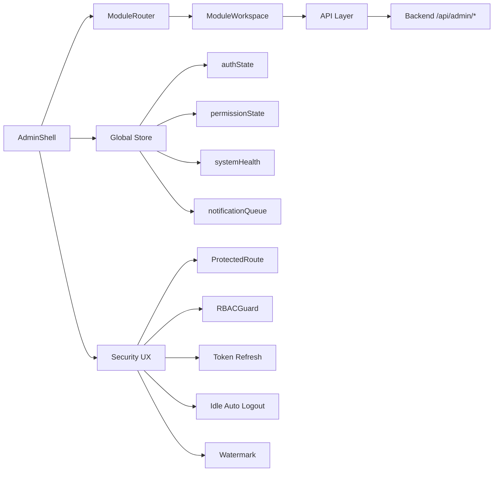

# ADMIN CONTROL PANEL - Architecture & Integration Spec

## 1) UI Architecture Diagram



## 2) Component Tree

```
App
└── /admin/* → AdminControlPanel
    └── ProtectedRoute
        └── AdminStoreProvider
            └── AdminShell
                ├── AdminSidebar (collapsible)
                ├── AdminTopbar (system status, alert badge, profile, dark mode)
                ├── AdminBreadcrumb
                ├── ModuleRouter
                │   ├── DashboardWorkspace
                │   ├── CrawlersWorkspace
                │   ├── FeedbackWorkspace
                │   ├── GovernanceWorkspace
                │   ├── KnowledgeBaseWorkspace
                │   ├── MLOpsWorkspace
                │   ├── OpsWorkspace
                │   └── SettingsWorkspace
                ├── GlobalSearch (Ctrl/Cmd + K)
                ├── ToastCenter
                └── Watermark (admin id)
```

## 3) Route Map

| Route | Guard | Permission |
|---|---|---|
| /admin | ProtectedRoute | - |
| /admin/dashboard | ProtectedRoute | - |
| /admin/crawlers | ProtectedRoute + RBACGuard | feedback:view |
| /admin/feedback | ProtectedRoute + RBACGuard | feedback:view |
| /admin/governance | ProtectedRoute + RBACGuard | feedback:modify |
| /admin/kb | ProtectedRoute + RBACGuard | feedback:view |
| /admin/mlops | ProtectedRoute + RBACGuard | feedback:modify |
| /admin/ops | ProtectedRoute + RBACGuard | feedback:view |
| /admin/settings | ProtectedRoute | - |

## 4) API Integration Spec

### Core client
- File: `src/admin-ui/services/apiClient.ts`
- Features:
  - Access token inject (`Authorization: Bearer ...`)
  - CSRF inject on non-GET (`X-CSRF-Token`)
  - Retry exponential backoff (2 retries)
  - Circuit breaker (open after 5 failures, reset 10s)
  - Error normalize (`status`, `code`, `message`, `retriable`)
  - Auto refresh token on 401

### Endpoint registry
- File: `src/admin-ui/services/endpoints.ts`
- No scattered hardcoded endpoint path in module UIs.

### Module API facade
- File: `src/admin-ui/services/adminModulesApi.ts`
- Encapsulates module-level calls:
  - System health
  - Crawlers
  - Feedback
  - Governance
  - Knowledge Base
  - MLOps
  - Ops

## 5) Permission Matrix

| Role | feedback:view | feedback:modify | feedback:assign | feedback:delete | feedback:export |
|---|---:|---:|---:|---:|---:|
| viewer | ✅ | ❌ | ❌ | ❌ | ❌ |
| operator | ✅ | ✅ | ✅ | ❌ | ❌ |
| admin | ✅ | ✅ | ✅ | ✅ | ✅ |

## 6) Figma-like Wireframe (Textual)

```
┌───────────────────────────────────────────────────────────────────────────────┐
│ Sidebar (fixed, collapsible) │ Topbar: Search | System | Alerts | Dark | User │
│ Dashboard                      ├───────────────────────────────────────────────┤
│ Crawlers                       │ Breadcrumb: admin / feedback                │
│ Feedback                       ├───────────────────────────────────────────────┤
│ Governance                     │ Main Panel (Dynamic Workspace)              │
│ Knowledge Base                 │ - Module Header                             │
│ MLOps                          │ - Grid Cards (module capabilities)          │
│ Ops                            │ - Context Help                              │
│ Settings                       │ - Toast/Alerts                              │
│ Logout                         │                                             │
└───────────────────────────────────────────────────────────────────────────────┘
Watermark: ADMIN <adminId> at bottom-right
```

## 7) Testing Plan (Skeleton)

- Unit tests (Jest-compatible structure):
  - `apiClient`: retry, circuit breaker, normalize error
  - `RBACGuard`: permission matrix behavior
  - `ProtectedRoute`: redirect when unauthenticated
- E2E (Playwright):
  - Login success + route access by role
  - `/admin/*` protection
  - module navigation + keyboard search shortcut
- Visual tests:
  - Sidebar collapse/expand
  - dark mode snapshot
  - module cards layout per breakpoint
- Permission tests:
  - viewer denied governance/mlops
  - operator denied delete/export-only operations

## Security UI Notes

- XSS protection: React default escaping, no `dangerouslySetInnerHTML` in admin-ui.
- CSP: enforce at gateway/reverse proxy for production (`script-src 'self'`, strict `connect-src`).
- Token refresh: automatic in apiClient.
- Idle auto logout: enabled via `VITE_ADMIN_IDLE_TIMEOUT_MS`.
- Screen watermark: enabled in AdminShell.
