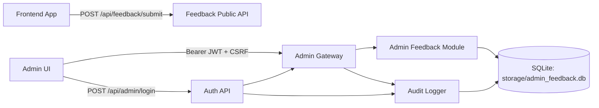

# FEEDBACK MODULE - AI Career Platform

## 1) System Architecture Diagram



**Enforced path:** Frontend → Auth API → Admin Gateway → Admin Modules.

## 2) API Spec

### Public Feedback
- `POST /api/feedback/submit`
  - Body:
    ```json
    {
      "userId": "user_123",
      "email": "user@example.com",
      "rating": 4,
      "category": "UI/UX",
      "message": "Trải nghiệm tốt nhưng cần tối ưu load.",
      "screenshot": "data:image/png;base64,...",
      "meta": {
        "page": "/dashboard",
        "version": "1.0.0",
        "sessionId": "sess_abcd"
      }
    }
    ```

### Admin Auth
- `POST /api/admin/login`
- `POST /api/admin/refresh`
- `POST /api/admin/logout`

JWT payload:
```json
{
  "adminId": "adm_xxx",
  "role": "admin",
  "permissions": ["feedback:view", "feedback:modify", "feedback:assign", "feedback:delete", "feedback:export"],
  "sessionId": "sid_xxx",
  "csrf": "token",
  "iat": 1730000000,
  "exp": 1730001800
}
```

### Admin Feedback
- `GET /api/admin/feedback`
- `PATCH /api/admin/feedback/{id}/status`
- `PATCH /api/admin/feedback/{id}/reviewer`
- `POST /api/admin/feedback/{id}/archive`
- `DELETE /api/admin/feedback/{id}`
- `GET /api/admin/feedback/export/csv`

## 3) DB Schema

### feedback
- `id` (PK)
- `user_id`
- `email`
- `rating`
- `category`
- `message`
- `status` (`new/reviewed/closed/archived`)
- `priority` (`low/medium/high/critical`)
- `created_at`
- `reviewed_by`
- `screenshot`
- `meta` (JSON)
- `archived`

### admins
- `id` (PK)
- `username` (unique)
- `password_hash` (bcrypt)
- `role`
- `last_login`

### admin_actions
- `id` (PK)
- `admin_id`
- `action`
- `target_id`
- `ip`
- `details`
- `timestamp`

### refresh_tokens
- `token_id` (PK)
- `admin_id`
- `expires_at`
- `revoked`

## 4) Frontend Components

- `src/components/FeedbackForm.jsx`
  - Fields: user_id(auto), email, rating, category, message, screenshot(optional), timestamp
  - UX: modal + button `Gửi phản hồi`
  - States: loading/success/error + client-side validation
- `src/pages/Admin/Auth/AdminLogin.jsx`
- `src/components/auth/AdminRouteGuard.jsx`
- `src/pages/Admin/Feedback/FeedbackAdminSecure.jsx`

## 5) Backend Modules

- `backend/modules/feedback/model.py`
- `backend/modules/feedback/repository.py`
- `backend/modules/feedback/service.py`
- `backend/modules/feedback/controller.py`
- `backend/modules/feedback/routes.py`
- `backend/modules/admin_auth/service.py`
- `backend/modules/admin_auth/middleware.py`
- `backend/modules/admin_auth/routes.py`
- `backend/modules/admin_gateway/routes.py`

## 6) Security Layer

Implemented:
- HTTPS enforcement toggle: `ENFORCE_HTTPS=true`
- Security headers (HSTS, X-Frame-Options, X-Content-Type-Options, Referrer-Policy)
- CSRF token required on non-GET admin requests
- Rate limit: public feedback submit (in-memory window)
- Brute-force protection: login attempts per IP
- IP whitelist for admin (`ADMIN_IP_WHITELIST`)
- Session timeout: JWT `exp`
- Audit log: login/view/modify/delete/export actions

## 7) Test Plan

### Unit
- Auth service: login success/fail, refresh rotation, token verify
- Feedback repository: submit/filter/paginate/update/archive/delete
- Middleware: reject missing JWT/CSRF/invalid role/IP

### Integration
- Public submit → persisted in DB
- Admin login → access admin feedback APIs
- Export CSV content and headers

### Security
- Brute-force lock after threshold
- 401 when token expired
- 403 when CSRF missing/invalid
- 403 when IP not whitelisted

## 8) Deployment Guide

1. Install backend deps:
   - `pip install -r backend/requirements_api.txt`
2. Set env vars (production):
   - `ADMIN_JWT_SECRET`
   - `ADMIN_REFRESH_SECRET`
   - `ADMIN_DEFAULT_USERNAME`
   - `ADMIN_DEFAULT_PASSWORD`
   - `ADMIN_IP_WHITELIST`
   - `ENFORCE_HTTPS=true`
3. Start backend:
   - `python backend/run_api.py`
4. Start frontend:
   - `cd ui-vite && npm run dev`
5. Access:
   - User feedback button on public pages
   - Admin login at `/admin/login`
   - Admin feedback dashboard at `/admin/feedback`
