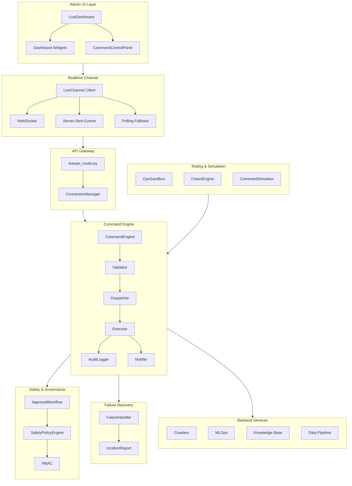
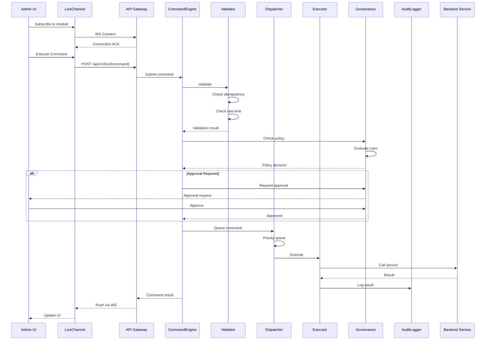
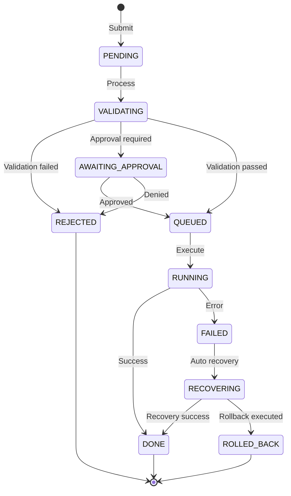

# LIVEOPS_ARCHITECTURE.md
## GIAI ĐOẠN C.1 — Live Ops Integration Layer Architecture



## Data Flow



## Command State Machine



## Module Structure

```
backend/ops/
├── command_engine/
│   ├── __init__.py
│   ├── models.py        # Command, CommandState, CommandResult
│   ├── validator.py     # CommandValidator - idempotency, rate limiting
│   ├── dispatcher.py    # CommandDispatcher - priority queue, circuit breaker
│   ├── executor.py      # CommandExecutor - retry, timeout, rollback
│   ├── audit.py         # CommandAudit - JSONL logging
│   ├── notifier.py      # CommandNotifier - multi-channel notifications
│   └── engine.py        # CommandEngine - main orchestrator
│
├── governance/
│   ├── __init__.py
│   ├── safety_policy.py    # SafetyPolicyEngine - policy evaluation
│   └── approval_workflow.py # ApprovalWorkflow - multi-approver support
│
├── recovery/
│   ├── __init__.py
│   └── failure_handler.py  # FailureHandler - recovery, compensation
│
└── testing/
    ├── __init__.py
    ├── sandbox.py      # OpsSandbox - isolated testing
    ├── chaos.py        # ChaosEngine - chaos testing
    └── simulator.py    # CommandSimulator - dry-run

backend/api/routers/
└── liveops_router.py   # All LiveOps API endpoints

ui-vite/src/admin-ui/
├── interface/
│   └── liveChannel.ts  # WebSocket/SSE/Polling client
│
└── modules/liveops/
    ├── index.ts
    ├── types.ts        # TypeScript types
    ├── service.ts      # API service functions
    ├── useLiveChannel.ts # React hook
    ├── widgets.tsx     # Dashboard widgets
    └── CommandControlPanel.tsx
```

## API Endpoints

| Method | Path | Description |
|--------|------|-------------|
| WS | `/api/v1/live/ws` | WebSocket realtime channel |
| GET | `/api/v1/live/sse` | Server-Sent Events stream |
| GET | `/api/v1/live/poll` | Polling fallback |
| POST | `/api/v1/live/crawler/kill` | Kill crawler |
| POST | `/api/v1/live/job/pause` | Pause job |
| POST | `/api/v1/live/job/resume` | Resume job |
| POST | `/api/v1/live/kb/rollback` | Rollback KB |
| POST | `/api/v1/live/mlops/freeze` | Freeze model |
| POST | `/api/v1/live/mlops/retrain` | Retrain model |
| POST | `/api/v1/live/simulate` | Simulate command |
| GET | `/api/v1/live/commands/{id}` | Get command status |
| POST | `/api/v1/live/commands/{id}/cancel` | Cancel command |
| GET | `/api/v1/live/commands` | List commands |
| POST | `/api/v1/live/commands/{id}/approve` | Approve command |
| GET | `/api/v1/live/widget/{type}` | Get widget data |

## Safety Policies

| Policy | Command Types | Requirements |
|--------|--------------|--------------|
| prod_crawler_kill | crawler_kill | role=admin, scope=production → approval required |
| model_freeze | mlops_freeze | role=admin → approval required |
| kb_rollback | kb_rollback | role=admin, scope=production → approval + extra data protection |
| dev_job_controls | job_pause, job_resume | scope=development → no approval |
| viewer_restrictions | all | role=viewer → read-only operations only |

## Technology Stack

- **Backend**: FastAPI, Pydantic, asyncio
- **Frontend**: React, TypeScript, Vite
- **Realtime**: WebSocket, SSE, Polling fallback
- **Auth**: JWT, RBAC
- **Audit**: JSONL file logging with rotation
- **Notifications**: WebSocket push, email, webhook, Slack
