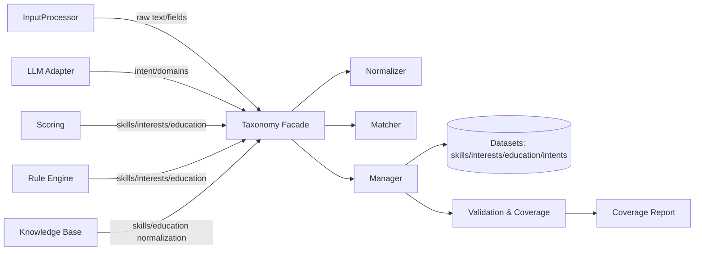

**Taxonomy Architecture**

```mermaid
flowchart LR
  A[InputProcessor] -->|raw text/fields| T[Taxonomy Facade]
  L[LLM Adapter] -->|intent/domains| T
  S[Scoring] -->|skills/interests/education| T
  R[Rule Engine] -->|skills/interests/education| T
  K[Knowledge Base] -->|skills/education normalization| T

  T --> N[Normalizer]
  T --> M[Matcher]
  T --> G[Manager]
  G --> D[(Datasets: skills/interests/education/intents)]

  G --> V[Validation & Coverage]
  V --> RPT[Coverage Report]
```
